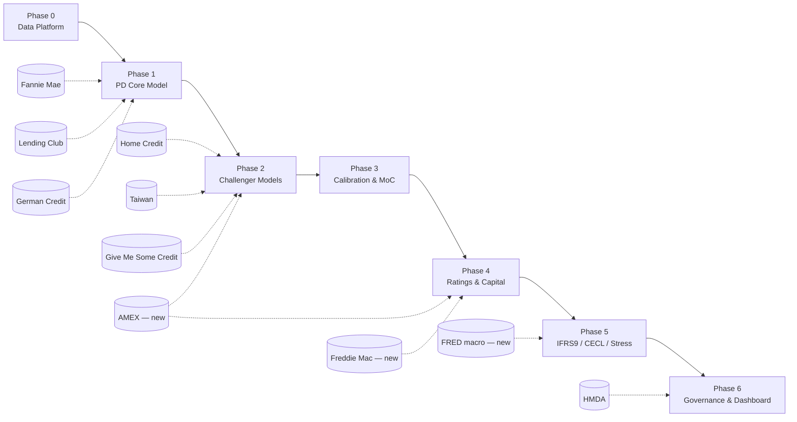

# Credit Risk Portfolio — Roadmap & Decision Log

Working plan only. Nothing here is built until a row moves to ✅ and we explicitly say go.

## 1. Datasets — what we have

| Dataset | Status | Rows / Size | Real target? | Time series? |
|---|---|---|---|---|
| Fannie Mae (mortgage) | Raw only, no pipeline (deleted with old `ingest.py`) | ~59 GB, 2000Q1–2025Q4 | No — field layout undocumented | Yes, monthly |
| Lending Club (unsecured) | ✅ Built (`build_lendingclub.py`) | 1.2M rows staged | Yes (`is_bad`) | Partial (issue date only) |
| German Credit | Raw only | 1,000 rows | Yes | No |
| Give Me Some Credit | Raw only | Kaggle benchmark | Yes | No |
| Home Credit | Raw only | Multi-table (bureau + balances) | Yes | Partial (bureau balance) |
| Taiwan Credit Default | Raw only | 30,000 rows, 2005 | Yes | 6 months |
| HMDA 2024 | Raw only | Large, application-level | N/A — disposition only, no repayment data | No |
| **FRED macro data** | **Not fetched yet** | UNRATE, CSUSHPINSA, GDP | — | Yes |
| **AMEX Default Prediction** | **Not fetched yet** | ~1yr/customer statements | Yes | Yes |
| **Freddie Mac SF Loan-Level** | **Not fetched yet** | Comparable to FNMA | Yes | Yes |

## 2. Datasets — what we want (phase mapping)

| Phase | Business question | Primary segment(s) | Supporting dataset(s) |
|---|---|---|---|
| 1 — PD Core Model | Who's likely to default? | Fannie Mae + Lending Club | German Credit *(teaching example)* |
| 2 — Challenger Models | Can we predict it better? | Fannie Mae + Lending Club | Home Credit, Taiwan, GMSC, **AMEX** |
| 3 — Calibration & MoC | How confident are the odds? | Fannie Mae + Lending Club | — |
| 4 — Ratings & Capital | How much capital/loss? | Fannie Mae + Lending Club | Taiwan, **AMEX** (CCF), **Freddie Mac** (LGD fallback) |
| 5 — IFRS9/CECL/Stress | What happens in a downturn? | Fannie Mae + Lending Club | **FRED** (required, currently missing) |
| 6 — Governance & Dashboard | Is it fair & controlled? | Fannie Mae + Lending Club | HMDA |

## 3. Open architecture decisions (not yet resolved)

| # | Decision | Options | Status |
|---|---|---|---|
| A1 | Reproducibility / lineage tracking | Full log · lightweight one-file manifest · defer until Phase 1 needs it | ⬜ undecided |
| A2 | `dev`/`test`/`prod`/`audit` environments | Keep · drop (no automated tests) · small fixture + light tests | ⬜ undecided |
| A3 | Fannie Mae's 59GB size | Full-file discovery (may be too slow) · sample-based discovery · chunking allowed *only* for this dataset | ⬜ undecided |
| A4 | Segmentation config (mortgage vs. unsecured) | Shared config file · each phase writes it inline | ⬜ undecided |
| A5 | Repo structure for exec readability | Rename phase folders to business questions + one-page front door per phase + root narrative memo | ⬜ proposed, not built |
| A6 | Lending Club vintage window | `2013–2017` (recommended from EDA) | ⬜ needs your confirm |
| A7 | Phase 2 scope | Build Home Credit/Taiwan/GMSC/AMEX now, or defer until Phase 1 is done | ⬜ undecided |

## 4. TODO — remaining work

| # | Task | Depends on | Status |
|---|---|---|---|
| 1 | Confirm Lending Club vintage window (`2013–2017`) | A6 | ⬜ |
| 2 | Commit the 42 pending Lending Club files to git | — | ⬜ |
| 3 | Resolve A1–A5 (architecture decisions above) | discussion | ⬜ |
| 4 | Fetch FRED macro series (UNRATE, CSUSHPINSA, GDP) + Fed stress scenarios | — | ⬜ |
| 5 | Evaluate AMEX Default Prediction dataset (license, size, fit) | — | ⬜ |
| 6 | Evaluate Freddie Mac SF Loan-Level dataset as FNMA fallback | — | ⬜ |
| 7 | Apply discover→decide→build to Fannie Mae (EDA on sample first, given size) | A3 | ⬜ |
| 8 | Decide + build Phase 1 scope (Fannie Mae + Lending Club + German Credit) | A7, item 7 | ⬜ |
| 9 | Rebuild repo structure per A5 (business-facing names, front-door pages) | A5 | ⬜ |
| 10 | Write root-level executive narrative memo | item 9 | ⬜ |

## 5. Legend

✅ done &nbsp;·&nbsp; ⬜ not started &nbsp;·&nbsp; 🔶 in progress
