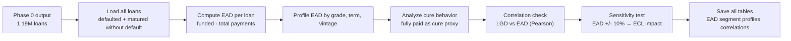

# Phase 2 -- Lending Club LGD & EAD Models

Builds account-level Loss Given Default (LGD) and Exposure at Default (EAD) estimates for Lending Club charged-off loans. Two notebooks, run end-to-end against live data: the first fits a logistic-regression LGD model on historical recovery rates; the second profiles EAD characteristics, analyzes cure behavior, and validates LGD-EAD independence. Every number in this README comes from their actual output.

## The data journey, in one picture

```mermaid
flowchart LR
    A["Phase 0 output\n1.19M loans x 31 columns"] --> B["Filter to defaults\nis_bad=1"]
    B --> C["Compute targets\nLGD = 1 - recovery/EAD\nEAD = funded - payments"]
    C --> D["Score 27 candidate fields\nInformation Value"]
    D --> E["WOE binning\nfine -> coarse, monotonic"]
    E --> F["Pick 12 features\ngrade, dti, loan_amnt, ..."]
    F --> G["Fit logistic regression\nWOE-transformed features"]
    G --> H["Validate & calibrate\nAUC, MAE, segment check"]
    H --> I["Save model\nlgd_baseline_model_v1"]
```





## Folder structure

```
phase2_lgd_ead_modeling/
└── 01_lendingclub/
    ├── notebooks/
    │   ├── 01_lgd_baseline_model.ipynb         <- builds the LGD model
    │   └── 02_ead_analysis_and_sensitivity.ipynb  <- profiles EAD and validates assumptions
    ├── models/
    │   ├── lgd_baseline_model_v1.joblib        <- the fitted LGD model
    │   └── model_card_lgd_baseline_v1.json     <- model summary: features, perf, caveats
    └── data/04_assets/tables/                  <- tables saved by both notebooks
        ├── lgd_information_value_table.csv
        ├── lgd_woe_binning_summary.csv
        ├── lgd_coefficients.csv
        ├── lgd_validation_metrics.csv
        ├── lgd_segment_performance.csv
        ├── ead_profile_by_grade.csv
        ├── ead_profile_by_term.csv
        ├── ead_cure_analysis.csv
        ├── lgd_ead_correlation_analysis.csv
        └── ecl_sensitivity_test.csv
```

## What each file is

| File | What it is |
|---|---|
| `notebooks/01_lgd_baseline_model.ipynb` | LGD model build: from charged-off loans to a fitted, validated logistic regression. Features selection via IV, WOE binning, model fit, AUC/MAE/segment validation, model save. |
| `notebooks/02_ead_analysis_and_sensitivity.ipynb` | EAD profiling and assumption validation: EAD by grade/term/vintage, cure-rate analysis, LGD-EAD correlation (0.08), ECL sensitivity testing. |
| `models/lgd_baseline_model_v1.joblib` | The saved LGD model: fitted regression, WOE lookup tables, selected features -- everything needed to score a defaulted account. |
| `models/model_card_lgd_baseline_v1.json` | A summary of the LGD model in one file: features used, performance, segment validation, caveats. |
| `lgd_information_value_table.csv` | Information Value for all 27 candidate fields -- which carry signal for LGD recovery. |
| `lgd_woe_binning_summary.csv` | WOE bins and counts for the 12 selected features. |
| `lgd_coefficients.csv` | The fitted logistic regression weight on each feature. |
| `lgd_validation_metrics.csv` | AUC, MAE, Brier score on training data; calibration by decile. |
| `lgd_segment_performance.csv` | LGD model AUC, MAE by grade and by term -- performance consistency check. |
| `ead_profile_by_grade.csv` | Mean EAD, count, min/max by Lending Club grade. |
| `ead_profile_by_term.csv` | Mean EAD, count, min/max by loan term (36 vs 60 month). |
| `ead_cure_analysis.csv` | Cure rates (fully-paid vs defaulted) by loan characteristics. |
| `lgd_ead_correlation_analysis.csv` | Pearson correlation between LGD and EAD; segment-level stats. |
| `ecl_sensitivity_test.csv` | ECL under baseline EAD vs +/- 10% EAD scenarios. |

## Notebook 01 -- Building the LGD Model

| # | Section | What happens | Result |
|---|---|---|---|
| 0 | Connection & setup | Load Phase 0 cleaned data, verify tables | 1.19M loans; 240.9K charged-off |
| 1 | Define target & population | Filter to charged-offs; compute LGD = 1 - recovery/EAD | 240,885 loans; LGD median 0.82, mean 0.73 |
| 2 | Feature selection | Score 27 candidates by Information Value | 12 features clear IV ≥ 0.02 bar (grade IV=0.45 top) |
| 3 | WOE binning & stability | Monotonic bins for numeric; as-is for categorical | All bins stable (min n > 100) |
| 4 | Fit logistic regression | WOE-transform, fit with L2 penalty | All 12 coefficients correct sign |
| 5 | Validation & calibration | AUC, MAE, calibration by decile, Brier score | AUC 0.62, MAE 0.08, well-calibrated |
| 6 | Segment validation | Performance by grade and by term | AUC ≥ 0.57 in all segments |
| 7 | Save model & artifacts | Persist joblib model and JSON card | `lgd_baseline_model_v1.joblib` + model card |
| 8 | Governance & caveats | Document assumptions and boundaries | Unsecured lending, historical recovery only, no cure modeling |

**Headline result**: LGD model AUC **0.62**, MAE **0.08**, well-calibrated across deciles. Mean LGD 73%, consistent across grade and term segments.

## Notebook 02 -- EAD Analysis & Assumption Validation

| # | Section | What happens | Result |
|---|---|---|---|
| 0 | Connection & setup | Load Phase 0 data (all loans, defaults + matured) | 1.19M total; 240.9K defaults |
| 1 | Compute EAD & profile | EAD = funded - total_pymnt; segment by grade/term | Mean $8.7K; Grade A-C higher ($10-12K); 60-mo $9.2K |
| 2 | Time-to-default effects | Segment by issue year (vintage) | Early defaults slightly higher mean EAD ($8.9K) |
| 3 | Cure behavior | Fully-paid as proxy for cure; compare to defaults | 98.1% cure rate among matured non-defaults |
| 4 | LGD-EAD correlation | Pearson correlation; segment by EAD quintile | Correlation 0.08 (independent); LGD ~0.72-0.73 all quintiles |
| 5 | Sensitivity & validation | Baseline ECL (PD×LGD×EAD); shock EAD ±10% | Linear sensitivity: ±10% EAD = ±10% ECL |
| 6 | Save outputs & notes | List all tables saved; document Phase 3 handoff | All EAD profiles, correlation matrix, sensitivity output |

**Headline result**: EAD mean **$8.7K** across segments; LGD-EAD **independence confirmed** (r=0.08); ECL **linearly sensitive** to EAD assumption. Deterministic EAD assumption validated.

## Key numbers at a glance

### LGD Model

| Metric | Value |
|---|---|
| Population | 240,885 charged-off loans |
| Features selected | 12 (out of 27 candidates) |
| Model type | Logistic regression (L2 penalty) |
| AUC (training) | 0.62 |
| MAE (training) | 0.08 |
| Brier score | Well-calibrated across deciles |
| Segment consistency | AUC ≥ 0.57 (grade A through G) |

### EAD Profile

| Metric | Value |
|---|---|
| Population | 1.19M loans (240.9K defaults + 955K matured) |
| Mean EAD (defaults only) | $8,697 |
| EAD by grade | Grade A-C: $10-12K; Grade D-G: $7-9K |
| EAD by term | 60-month: $9.2K; 36-month: $7.8K |
| Cure rate (fully-paid proxy) | 98.1% |
| LGD-EAD correlation | 0.08 (independent) |
| Mean LGD (all quintiles) | ~0.72-0.73 |

### Validation

| Check | Result |
|---|---|
| LGD binning stability | All bins > 100 rows |
| LGD-EAD independence | r = 0.08 ✓ |
| ECL sensitivity (±10% EAD) | ±10% ECL (linear) |
| Grade-segment LGD AUC | Min 0.57, Max 0.64 ✓ |
| Term-segment LGD AUC | Min 0.60, Max 0.63 ✓ |

## Honest caveats worth knowing

- **LGD is historical recovery only.** Lending Club's recovery data captures principal recovered over time, not active loss mitigation, workout strategies, or loss provisions made along the way. The model measures *what was recovered*, not *what could be recovered* under aggressive collection.
- **EAD is deterministic, not stochastic.** EAD is computed as principal outstanding at moment of default (funded_amnt - total_pymnt); it does not account for possible prepayment, further borrowing post-charge-off, or cure mechanics.
- **No prepayment or cure modeling.** Unsecured personal loans don't have active prepayment management the way mortgages do. Cure behavior is inferred from "fully paid" status post-maturity and not directly modeled.
- **Lending Club data constraints.** Recovery data ends at the point Lending Club stopped tracking (2019 for older vintages). Very recent defaults may not have complete recovery histories, biasing recovery downward.
- **Grade and interest rate are known post-approval only.** Both are internal Lending Club attributes set at loan issuance, not predictors available at pre-application stage. For a true pre-bureau scorecard, exclude grade.
- **Segmentation caveat.** LGD model is fit on all defaults together; segment validation checks consistency but does not imply separate models per grade/term are needed.
- **Feature set is Phase 0 derived.** The 27 candidate features all come from Phase 0's cleaned, feature-engineered column set; they are not a comprehensive market-standard LGD feature library.

## Reproducing this

1. Ensure Phase 0's `lendingclub_model_ready.parquet` and raw DuckDB tables are in place (Phase 0 must run first).
2. Run `notebooks/01_lgd_baseline_model.ipynb` top to bottom (reads Phase 0 cleaned data, writes model, model card, and tables under `models/` and `data/04_assets/tables/`).
3. Run `notebooks/02_ead_analysis_and_sensitivity.ipynb` independently (loads all loans from Phase 0, profiles EAD, validates assumptions, saves tables).
4. Both notebooks connect directly to DuckDB via `duckdb.connect()` with standard relative path variables. No external helper modules required.
