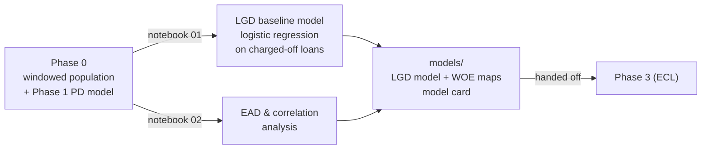

# Phase 2 -- LGD & EAD Models

*Credit Risk Portfolio · Loss Given Default and Exposure at Default*

Phase 2 turns each dataset's Phase 1 PD model and Phase 0 windowed population into fitted, production-style LGD and EAD estimates -- defining the loss/recovery and outstanding-balance dynamics that feed ECL provisioning and capital calculations downstream. This phase answers: *when a loan defaults, how much is recovered, and how much was still outstanding at the moment of default?*

---

## Contents

- [How a dataset moves through Phase 2](#how-a-dataset-moves-through-phase-2)
- [Folder structure (every dataset follows this)](#folder-structure-every-dataset-follows-this)
- [Dataset build status](#dataset-build-status)
- [Design principles](#design-principles)
- [Repository layout](#repository-layout)

---

## How a dataset moves through Phase 2



## Folder structure (every dataset follows this)

```
NN_dataset_name/
├── README.md                     dataset-specific notes and results
├── notebooks/
│   ├── 01_lgd_baseline_model.ipynb         LGD scorecard, feature selection to validation
│   └── 02_ead_analysis_and_sensitivity.ipynb  EAD profiling, cure analysis, correlation check
├── models/
│   ├── lgd_baseline_model_v1.joblib        the fitted LGD model
│   └── model_card_lgd_baseline_v1.json     features, performance, calibration, caveats
└── data/04_assets/tables/                  every headline table, saved standalone
```

## Dataset build status

| # | Dataset | Status | Headline result |
|---|---|---|---|
| 01 | **Lending Club** | Phase 2 complete -- see [`01_lendingclub/README.md`](01_lendingclub/README.md) | LGD model AUC 0.62, MAE 0.08; EAD-LGD correlation 0.08 (independent); mean EAD $8.7K across segments |
| 02 | **Fannie Mae** | Not started (awaiting Phase 0) | -- |

## Design principles

- **One notebook, one model per dimension.** `01_lgd_baseline_model.ipynb` handles LGD end-to-end: population definition, target computation, feature selection, binning, fitting, validation, and model save. `02_ead_analysis_and_sensitivity.ipynb` profiles EAD characteristics, analyzes cure rates, and computes key assumptions for Phase 3.
- **Population matters deeply.** LGD and EAD are defined *only for loans that defaulted*. Charge-off status, recovery facts, and time-to-default all flow from Phase 0's matured-loan window and are not recomputed here.
- **Every number is computed live.** Model cards and tables are written by the notebook that produced them, from that notebook's own run -- never copied from a spreadsheet or earlier draft.
- **Honest about scope.** Lending Club data lacks prepayment details and active-cure mechanisms. LGD is historical recovery only. EAD is deterministic (principal outstanding at default). These boundaries are documented plainly.

## Repository layout

```
phase2_lgd_ead_modeling/
├── README.md                          this file
└── 01_lendingclub/
    ├── README.md
    ├── notebooks/
    ├── models/
    └── data/04_assets/tables/
```
