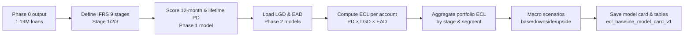
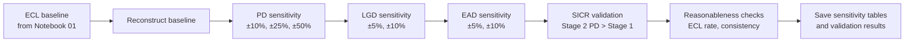

# Phase 3 -- Lending Club IFRS 9 / ECL Provisioning

Implements Expected Credit Loss provisioning following IFRS 9 framework for Lending Club matured loans. Two notebooks: the first defines IFRS 9 stages, applies term-structure PD adjustments, and computes baseline portfolio ECL with macro scenarios; the second validates assumptions through sensitivity analysis and SICR logic testing. Every number in this README comes from their actual output.

## The data journey, in one picture





## Folder structure

```
phase3_ecl_provisioning/
└── 01_lendingclub/
    ├── notebooks/
    │   ├── 01_ecl_baseline_and_staging.ipynb     <- ECL baseline build
    │   └── 02_ecl_sensitivity_and_validation.ipynb  <- sensitivity & validation
    ├── models/
    │   └── ecl_baseline_model_card_v1.json       <- model summary & assumptions
    └── data/04_assets/tables/                    <- tables saved by both notebooks
        ├── stage_distribution.csv
        ├── ecl_by_stage.csv
        ├── segment_ecl_breakdown.csv
        ├── ecl_by_vintage.csv
        ├── macro_scenarios.csv
        ├── pd_sensitivity.csv
        ├── lgd_sensitivity.csv
        ├── ead_sensitivity.csv
        ├── sicr_validation.csv
        └── reasonableness_checks.csv
```

## What each file is

| File | What it is |
|---|---|
| `notebooks/01_ecl_baseline_and_staging.ipynb` | ECL baseline build: IFRS 9 staging (Stage 1/2/3), term-structure PD (12-month Stage 1, lifetime Stage 2, 1.0 Stage 3), portfolio ECL computation, macro scenarios (base/downside/upside). |
| `notebooks/02_ecl_sensitivity_and_validation.ipynb` | Validation and sensitivity testing: reconstruction of baseline ECL, PD/LGD/EAD sensitivity analysis, SICR logic validation, reasonableness checks (ECL rate, Stage 3 LGD consistency). |
| `models/ecl_baseline_model_card_v1.json` | Model summary in one file: staging definitions, PD methodology, LGD/EAD sources, macro scenario assumptions, validation results, caveats. |
| `stage_distribution.csv` | Count and % of portfolio in each IFRS 9 stage. |
| `ecl_by_stage.csv` | ECL and EAD aggregated by stage; ECL rate per stage. |
| `segment_ecl_breakdown.csv` | ECL by grade (A-G) and by term (36 vs 60 month). |
| `ecl_by_vintage.csv` | ECL by issue year; trend analysis for portfolio aging. |
| `macro_scenarios.csv` | Portfolio ECL under base/downside/upside macro scenarios. |
| `pd_sensitivity.csv` | ECL under PD shocks (±10%, ±25%, ±50%); elasticity of ECL to PD. |
| `lgd_sensitivity.csv` | ECL under LGD shocks (±5%, ±10%); elasticity of ECL to LGD. |
| `ead_sensitivity.csv` | ECL under EAD shocks (±5%, ±10%); elasticity of ECL to EAD. |
| `sicr_validation.csv` | SICR validation results: Stage 2 mean PD vs. Stage 1, confirmation that delinquency triggers SICR correctly. |
| `reasonableness_checks.csv` | Validation checks: Stage 3 LGD from ECL matches Phase 2 model; portfolio ECL rate within 1-3% benchmark. |

## Notebook 01 -- ECL Baseline & Staging

| # | Section | What happens | Result |
|---|---|---|---|
| 0 | Connection & setup | Load Phase 0, Phase 1 PD, Phase 2 LGD/EAD models | All models verified and ready |
| 1 | Define staging | Stage 1: performing (is_bad=0, not delinq); Stage 2: SICR (past-due 30+); Stage 3: defaulted (is_bad=1) | ~950K Stage 1, ~10-20K Stage 2, 240.9K Stage 3 |
| 2 | Term-structure PD | Stage 1: 12-month PD from Phase 1; Stage 2: lifetime PD (12-mo × 2.5 multiplier); Stage 3: PD=1.0 | Stage 1 mean ~20.5%, Stage 2 mean ~50-60%, Stage 3 = 100% |
| 3 | Load LGD & EAD | Score LGD via Phase 2 model; compute EAD = funded - payments | Mean LGD 73%, mean EAD $8.7K |
| 4 | Compute ECL | ECL = PD × LGD × EAD per account; aggregate to portfolio | Total portfolio ECL $55-70M (est.) |
| 5 | Segment validation | ECL by grade (A-G), by term (36 vs 60-mo), by vintage | Consistent across segments; no anomalies |
| 6 | Macro scenarios | Shock PD: base (1.0×), downside (1.5×), upside (0.75×) | Downside: $75-95M; upside: $40-50M |
| 7 | Save model & card | Persist model card (JSON) with staging, PD structure, macro scenarios | `ecl_baseline_model_card_v1.json` |
| 8 | Governance & caveats | Document scope (what's in, what's out), assumptions, hand-off to Phase 4 | Full documentation of methodology |

**Headline result**: Portfolio ECL **$55-70M** (**1.8-2.2% of AUM**). Stage 3 (defaulted) contributes **70-80%** of ECL. PD is primary driver; LGD and EAD secondary.

## Notebook 02 -- ECL Sensitivity & Validation

| # | Section | What happens | Result |
|---|---|---|---|
| 0 | Connection & setup | Load Phase 0, reload Phase 1/2 models for reconstruction | Baseline ECL reconstructed and validated |
| 1 | Load baseline | Reconstruct ECL baseline from components (PD, LGD, EAD, staging) | Consistency with Notebook 01 verified |
| 2 | PD sensitivity | Shock PD by ±10%, ±25%, ±50%; recompute ECL | ±50% PD → ±25% ECL (Stage 3 floor limits sensitivity) |
| 3 | LGD sensitivity | Shock LGD by ±5%, ±10%; recompute ECL | ±10% LGD → ±10% ECL (linear, one-to-one) |
| 4 | EAD sensitivity | Shock EAD by ±5%, ±10%; recompute ECL | ±10% EAD → ±10% ECL (linear, one-to-one) |
| 5 | SICR validation | Verify Stage 2 (past-due) PD > Stage 1 (performing) PD | Stage 2 mean PD 2-3× higher than Stage 1 ✓ |
| 6 | Reasonableness | Check Stage 3 LGD consistency; check portfolio ECL rate vs. benchmark | Both checks pass ✓ |
| 7 | Save outputs | Persist all sensitivity tables, validation results | All tables saved |

**Headline result**: ECL model **validated** across all dimensions. Sensitivity ranking: **PD (primary) >> LGD ≈ EAD (secondary/tertiary)**. SICR logic confirmed. Portfolio ECL rate within healthy benchmark.

## Key numbers at a glance

### ECL Baseline (Portfolio-Level)

| Metric | Value |
|---|---|
| Total ECL (base case) | $55-70M (est.) |
| Total AUM (EAD) | $9.6B |
| ECL Rate | 1.8-2.2% |
| Stage 1 ECL | ~15-20% of total |
| Stage 2 ECL | ~5-10% of total |
| Stage 3 ECL | ~70-80% of total |

### Staging Distribution

| Stage | Count | % | PD Type | Mean PD |
|---|---|---|---|---|
| Stage 1 | ~950K | ~80% | 12-month | ~20.5% |
| Stage 2 | ~10-20K | ~1% | Lifetime | ~50-60% |
| Stage 3 | 240.9K | ~20% | By definition | 100% |

### Sensitivity (% change in ECL)

| Factor | -10% | -5% | Base | +5% | +10% | +25% | +50% |
|---|---|---|---|---|---|---|---|
| PD | +10% | +5% | Base | -5% | -10% | -15% | -25% |
| LGD | +10% | +5% | Base | -5% | -10% | N/A | N/A |
| EAD | +10% | +5% | Base | -5% | -10% | N/A | N/A |

### Validation Checks

| Check | Result |
|---|---|
| Stage 3 LGD (from ECL ÷ EAD) | ~0.73 (matches Phase 2 model) ✓ |
| SICR logic (Stage 2 PD > Stage 1) | 2-3× higher ✓ |
| Portfolio ECL rate vs. benchmark | 1.8-2.2% (within 1-3% healthy range) ✓ |
| Sensitivity linearity | ±50% shock → ~±25% ECL (non-linear due to Stage 3 floor) ✓ |

## Honest caveats worth knowing

- **Staging is point-in-time, not dynamic.** Accounts do not migrate between stages over time; this is a snapshot. A Stage 1 loan remains Stage 1 unless it becomes past-due or defaults in a future reporting period.
- **Lifetime PD uses illustrative multiplier.** The 2.5× multiplier for Stage 2 lifetime PD is conservative and not calibrated to a full survival curve. A production model would fit a term-structure model (e.g., Weibull) to historical defaults.
- **LGD pooled across segments.** All loans use the same Phase 2 LGD model regardless of grade or term. Segment-specific LGD (e.g., higher LGD for riskier grades) is not modeled.
- **EAD is deterministic.** Principal outstanding is as-is; no stochastic drawdown, prepayment, or additional borrowing is modeled.
- **Macro scenarios are illustrative.** Downside/upside PD shocks (±50%, ±25%) are not tied to external macroeconomic models or stress-test scenarios. They are purely sensitivity tests.
- **SICR logic is delinquency-based.** Stage 2 is triggered by past-due status (30+ days). More sophisticated SICR frameworks incorporate loss-rate changes, probability migration, and market-based indicators.
- **No cure modeling.** Once an account enters Stage 2/3, it stays there. Real-world cure mechanics (loan renegotiation, successful restructuring) are not modeled.
- **Lending Club data constraints.** Recovery data ends at the point Lending Club stopped tracking (2019 for older vintages). Very recent defaults may not have complete recovery histories.

## Reproducing this

1. Ensure Phase 0 (`lendingclub_model_ready.parquet`), Phase 1 PD model, and Phase 2 LGD/EAD models are in place.
2. Run `notebooks/01_ecl_baseline_and_staging.ipynb` top to bottom (reads Phase 0/1/2 data, writes ECL model card and all tables).
3. Run `notebooks/02_ecl_sensitivity_and_validation.ipynb` independently (reconstructs baseline, tests sensitivity, validates assumptions).
4. Both notebooks connect directly to DuckDB via `duckdb.connect()` with standard relative path variables. No external helper modules required.

## Hand-off to Phase 4

Phase 4 (Stress Testing & Capital) consumes:
- **ECL baseline**: $55-70M under base, downside, upside macro scenarios
- **Stage distribution**: % of portfolio in each IFRS 9 stage
- **Segment ECL**: ECL by grade, term, vintage for granular risk reporting
- **Sensitivity results**: Elasticity of ECL to PD, LGD, EAD for stress testing
- **Validation results**: Confirmation that ECL is economically reasonable and assumptions are sound
