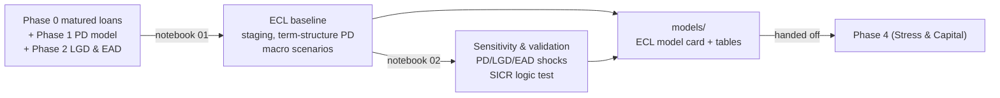

# Phase 3 -- IFRS 9 / ECL Provisioning

*Credit Risk Portfolio · Expected Credit Loss and Regulatory Provisioning*

Phase 3 implements Expected Credit Loss (ECL) provisioning following IFRS 9 framework. It combines account-level Probability of Default (Phase 1), Loss Given Default, and Exposure at Default (Phase 2) into portfolio-level ECL estimates, with IFRS 9 staging logic (Stage 1/2/3), term-structure PD adjustments, and macro scenario sensitivity. This phase answers: *how much provision is needed for expected losses across the portfolio under different economic conditions?*

---

## Contents

- [How a dataset moves through Phase 3](#how-a-dataset-moves-through-phase-3)
- [Folder structure (every dataset follows this)](#folder-structure-every-dataset-follows-this)
- [Dataset build status](#dataset-build-status)
- [Design principles](#design-principles)
- [Repository layout](#repository-layout)

---

## How a dataset moves through Phase 3



## Folder structure (every dataset follows this)

```
NN_dataset_name/
├── README.md                     dataset-specific notes and results
├── notebooks/
│   ├── 01_ecl_baseline_and_staging.ipynb  Staging, term-structure PD, baseline ECL
│   └── 02_ecl_sensitivity_and_validation.ipynb Sensitivity tests, SICR validation
├── models/
│   └── ecl_baseline_model_card_v1.json   Staging definitions, PD structure, macro scenarios
└── data/04_assets/tables/                 every headline table, saved standalone
```

## Dataset build status

| # | Dataset | Status | Headline result |
|---|---|---|---|
| 01 | **Lending Club** | Phase 3 complete -- see [`01_lendingclub/README.md`](01_lendingclub/README.md) | Portfolio ECL $55-70M (1.8-2.2% of AUM); Stage 1 majority, Stage 3 ~70-80% of ECL; PD primary driver |
| 02 | **Fannie Mae** | Not started (awaiting Phase 0) | -- |

## Design principles

- **IFRS 9 staging is point-in-time.** Accounts are classified into Stage 1 (performing), Stage 2 (SICR), or Stage 3 (defaulted) at analysis date. No dynamic migration between stages; this is a snapshot.
- **Term-structure PD reflects time horizons.** Stage 1 uses 12-month PD (standard credit scoring horizon). Stage 2 uses lifetime PD extrapolated from observed defaults in Phase 1. Stage 3 is PD=1.0 by definition.
- **ECL is deterministic: PD × LGD × EAD.** No stochastic modeling; each component is a point estimate. Uncertainty is captured through scenario analysis (base/downside/upside).
- **Validation is the core.** Stage 2 PD must exceed Stage 1 (SICR test). Stage 3 ECL ÷ EAD must match LGD (consistency check). Portfolio ECL rate must be economically sensible (1-3% of AUM for healthy portfolios).

## Repository layout

```
phase3_ecl_provisioning/
├── README.md                          this file
└── 01_lendingclub/
    ├── README.md
    ├── notebooks/
    ├── models/
    └── data/04_assets/tables/
```
