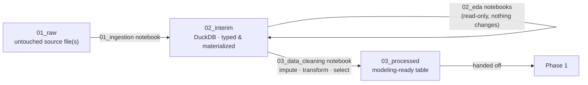

# Phase 0 — Data Platform

*Credit Risk Portfolio · foundational data layer*

Phase 0 turns each raw credit-risk dataset into a clean, well-understood,
modeling-ready table for Phase 1. Every dataset gets the same treatment —
ingest, understand, clean — through the same three-stage folder structure, so
switching between datasets never means re-learning where anything lives.

---

## Contents

- [How a dataset moves through Phase 0](#how-a-dataset-moves-through-phase-0)
- [Folder structure](#folder-structure-every-dataset-follows-this)
- [Dataset build order](#dataset-build-order)
- [How to read a dataset's Phase 0 work](#how-to-read-a-datasets-phase-0-work)
- [Design principles](#design-principles)
- [Repository layout](#repository-layout)

---

## How a dataset moves through Phase 0



Three rules hold across every dataset in this repo:

| Rule | What it means |
|---|---|
| **Raw stays raw** | `01_raw/` is never edited or overwritten in place — it's exactly what the source published. |
| **EDA never cleans** | `02_eda/` notebooks only read from `02_interim/`. No imputation, no transforms, no row drops. Ever. |
| **One cleaning notebook decides everything** | Every change that touches the data — missing-value handling, log transforms, feature selection — happens in `03_data_cleaning/`, in one place, so it's auditable end to end. |

---

## Folder structure (every dataset follows this)

```
NN_dataset_name/
├── README.md                     dataset-specific notes (added once a build starts)
├── data/
│   ├── 01_raw/                   untouched source file(s), exactly as published
│   ├── 02_interim/               a DuckDB file — typed, materialized, query-ready
│   ├── 03_processed/             final modeling table(s), handed off to Phase 1
│   └── 04_assets/                every chart and headline table saved standalone
│       ├── plots/                 (*.png) — reusable outside Jupyter, on top of
│       └── tables/                (*.csv) — the real output already embedded in
│                                  each notebook, not a replacement for it
└── notebooks/
    ├── 01_ingestion/             raw -> interim (builds the DuckDB file)
    ├── 02_eda/                   understanding the data — read-only
    └── 03_data_cleaning/         interim -> processed (the only stage that changes data)
```

Every notebook in this repo follows the same authoring rules, regardless of
dataset:

- **Top cell** — an index: what the notebook does, a table of every cell and
  what to expect from it, and what the notebook's final output is.
- **Above every code cell** — a markdown cell covering what the cell does,
  why, how, what to expect, and how it serves the notebook's goal.
- **Below every code cell** — a markdown cell interpreting the *actual*
  output (never fabricated) — what it shows, what insight it gives, and what
  that implies for the next cell.

---

## Dataset build order

7 datasets, built one at a time in the order below. Each slot was chosen for
what it adds to the portfolio — not difficulty for its own sake, but genuine
new territory (asset class, data shape, or modeling angle) over the datasets
before it.

| # | Dataset | Source | Target variable | Raw size | Shape | Status |
|---|---|---|---|---|---|---|
| 01 | **Lending Club** — accepted/rejected consumer loans | Kaggle | `is_bad` (charged off vs. fully paid) | ~650 MB (2 files) | 2.26M rows, wide (151 cols) | ✅ **Phase 0 complete** — ingestion, all 14 EDA notebooks, a cleaning pass rebuilt from the full EDA's findings, and a depth/sufficiency review whose 4 gaps (duplicates, leakage re-validation, outlier treatment, encoding strategy) are all closed; `03_processed/` output verified (1,195,879 × 42) |
| 02 | **Fannie Mae** — single-family loan performance | Fannie Mae public data | mortgage default / prepayment | ~63 GB | loan-month panel, very large | ⚪ Raw file staged only |
| 03 | **Home Credit** — Default Risk | Kaggle | `TARGET` (default) | ~720 MB | multi-table (application + bureau + prior applications) | ⚪ Raw file staged only |
| 04 | **Taiwan Credit Default** — credit card clients | UCI | default payment next month | ~5.5 MB | 30K rows, compact | ⚪ Raw file staged only |
| 05 | **HMDA** — mortgage disclosure | CFPB / HMDA public data | loan action taken (approved / denied) | ~660 MB | application-level, regulatory | ⚪ Raw file staged only |
| 06 | **Give Me Some Credit** | Kaggle | `SeriousDlqin2yrs` (delinquency) | ~5.4 MB | 150K rows, compact benchmark | ⚪ Raw file staged only |
| 07 | **German Credit** | UCI (Statlog) | creditability (good / bad) | ~90 KB | 1,000 rows, classic teaching set | ⚪ Raw file staged only |

**Why this order, in one line each:**

- **01 → 02**: from unsecured consumer lending to secured mortgage
  performance — same rigor, different asset class.
- **02 → 03**: Home Credit is the first dataset that isn't a single flat
  table — it forces multi-table joins and relational feature engineering.
- **03 → 04**: Taiwan closes out core asset-class coverage (revolving credit
  card risk) before the pipeline turns to regulatory data.
- **04 → 05**: HMDA answers a different question (was the loan *approved*,
  not how it performed) — best tackled once performance-modeling patterns
  from 01–04 are established.
- **05 → 06 → 07**: two small, classic benchmark datasets, saved for last —
  used to sanity-check technique against widely-known baselines rather than
  to build primary modeling depth.

---

## How to read a dataset's Phase 0 work

1. **Dataset README** — `NN_dataset/README.md` (currently only
   `01_lendingclub/` has one; each dataset gets one when its build starts).
2. **`notebooks/01_ingestion/`** — what's actually in the raw file, and how
   the interim DuckDB tables were built from it.
3. **`notebooks/02_eda/`** — one notebook per analysis category (data
   quality, univariate, bivariate/multivariate, temporal, target definition,
   and more). Each top cell tells you what to expect before you scroll.
4. **`notebooks/03_data_cleaning/`** — exactly how `data/03_processed/` was
   produced: every imputation, every transform, every dropped or kept
   feature, with the reasoning next to the code that does it.

---

## Design principles

- **No `.py` pipeline scripts.** Every stage — ingestion included — is a
  notebook, so the reasoning and the code that acts on it live in the same
  place, visible to anyone reading top to bottom.
- **Numbered, not named, stages.** `01_ingestion → 02_eda → 03_data_cleaning`
  and `01_raw → 02_interim → 03_processed` both encode order directly in the
  folder name — no need to know the pipeline to know what runs first.
- **Reproducible by construction.** Every notebook's markdown is generated
  from real, executed output — not written first and matched to the data
  later. Numbers in a notebook are numbers that notebook actually produced.
- **Charts and headline tables also live outside the notebook.** Every
  chart and each notebook's key finding table is additionally saved as a
  standalone file under `data/04_assets/` (`plots/*.png`, `tables/*.csv`) —
  reusable without opening Jupyter, generated by re-running the notebook's
  own real code, never a second analysis.
- **Progressive depth.** Not every dataset needs full 14-category EDA rigor
  immediately. Notebooks are scaffolded with an index and a stated plan
  first, then built out to full depth as the work reaches them.

---

## Repository layout

```
phase0_data_platform/
├── README.md                          this file
├── 01_lendingclub/
│   ├── README.md
│   ├── data/{01_raw,02_interim,03_processed,04_assets}/
│   └── notebooks/{01_ingestion,02_eda,03_data_cleaning}/
├── 02_fannie_mae/
│   └── data/{01_raw,02_interim,03_processed}/
├── 03_home_credit/
│   └── data/{01_raw,02_interim,03_processed}/
├── 04_taiwan_credit_default/
│   └── data/{01_raw,02_interim,03_processed}/
├── 05_hmda/
│   └── data/{01_raw,02_interim,03_processed}/
├── 06_give_me_some_credit/
│   └── data/{01_raw,02_interim,03_processed}/
└── 07_german_credit/
    └── data/{01_raw,02_interim,03_processed}/
```
