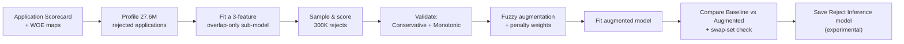

# Phase 1 -- Lending Club PD Scorecard

Builds the account-level Probability of Default (PD) model for Lending Club:
an accepted-loans application scorecard, plus a reject-inference
experiment that folds in declined applicants to assess selection bias. Two notebooks, run
end to end against live data -- every number in this README comes from
their actual output, not a spreadsheet.

## The data journey, in one picture

```mermaid
flowchart LR
    A["Phase 0 output\n1.19M loans x 31 columns"] --> B["Define target & window\nis_bad, 2013-2017"]
    B --> C["Split the data\ntrain / val / test / OOT 2017"]
    C --> D["Score 26 candidate fields\nInformation Value"]
    D --> E["WOE binning\nfine -> coarse, monotonic"]
    E --> F["Pick 15 features\ngrade vs int_rate, VIF"]
    F --> G["Fit logistic regression"]
    G --> H["Calibrate & validate\nHosmer-Lemeshow, Brier"]
    H --> I["Scale to points\n300-850 scorecard"]
    I --> J["Save model\npd_application_scorecard_v1"]
```





## Folder structure

```
phase1_pd_modeling/
└── 01_lendingclub/
    ├── notebooks/
    │   ├── 01_pd_application_scorecard.ipynb          <- builds the Application Scorecard
    │   └── 02_pd_reject_inference.ipynb              <- reject inference & augmented model
    ├── models/
    │   ├── pd_application_scorecard_v1.joblib         <- the primary PD model
    │   ├── model_card_application_scorecard_v1.json
    │   ├── pd_reject_inference_scorecard_v1.joblib    <- experimental, not used in prod
    │   └── model_card_reject_inference_v1.json
    └── data/04_assets/tables/                         <- tables saved by both notebooks
        ├── application_scorecard_iv_table.csv
        ├── application_scorecard_vif_table.csv
        ├── application_scorecard_coefficients.csv
        ├── application_scorecard_baseline_results.csv
        ├── application_scorecard_reason_code_points_table.csv
        ├── reject_inference_vs_baseline_comparison.csv
        └── rejected_file_policy_code_profile.csv
```

## What each file is

| File | What it is |
|---|---|
| `notebooks/01_pd_application_scorecard.ipynb` | The main build: from cleaned data to a fitted, scaled, and calibrated Application Scorecard. |
| `notebooks/02_pd_reject_inference.ipynb` | Tests whether adding declined applicants (reject inference) corrects selection bias and improves the scorecard. |
| `models/pd_application_scorecard_v1.joblib` | The saved model: fitted regression, WOE lookup tables, point-scaling constants -- everything needed to score a new application. |
| `models/model_card_application_scorecard_v1.json` | A summary of the model in one file: features used, performance by split, calibration stats. |
| `models/pd_reject_inference_scorecard_v1.joblib` / `model_card_reject_inference_v1.json` | The reject-inference model and its card -- kept for validation comparison, not recommended for production. |
| `application_scorecard_iv_table.csv` | Information Value for all 26 candidate fields (which ones carry signal). |
| `application_scorecard_vif_table.csv` | Multicollinearity check across the 15 chosen features. |
| `application_scorecard_coefficients.csv` | The fitted regression weight on each feature. |
| `application_scorecard_baseline_results.csv` | AUC / Gini / KS on train, validation, test, and OOT. |
| `application_scorecard_reason_code_points_table.csv` | The scorecard lookup table: points awarded per bin, per variable. |
| `reject_inference_vs_baseline_comparison.csv` | Side-by-side AUC, reject-inference model vs. accepted-only baseline. |
| `rejected_file_policy_code_profile.csv` | How complete `Risk_Score` is, by Policy Code, in the rejected-applicant file. |

## Notebook 01 -- Building the Application Scorecard

| # | Section | What happens | Result |
|---|---|---|---|
| 1 | Define the target & population | Confirm what "bad" means and which loans count | 1.19M matured loans, 2013-2017 |
| 2 | Vintage diagnostic | Check how much of each year's loans have a final outcome | Only 38.2% of 2017 loans have matured -- a real caveat on OOT |
| 3 | Train/val/test/OOT split | 60/20/20 split of 2013-2016; 2017 held out entirely | 615,934 / 205,312 / 205,312 / 169,321 rows |
| 4 | Feature selection | Score 26 candidate fields by Information Value | 16 clear the bar, 10 dropped as "useless" |
| 5 | WOE binning | Turn each kept field into monotonic, stable bins | Every bin has enough volume to be reliable |
| 6 | Grade vs. interest rate | Two near-identical signals (corr 0.958) -- pick one | **Keep `grade`**, Lending Club's own published rating |
| 7 | Fit the model | Logistic regression on 15 WOE-transformed features | All 15 coefficients have the expected sign |
| 8 | Validate grade itself | Check Lending Club's own A-G scale is well-behaved | Cleanly monotonic bad rate, A through G |
| 9 | Interest-rate drift | Should the excluded `int_rate` still be watched? | Yes -- monitor only, PSI 0.04-0.07 |
| 10 | Calibration | Do predicted odds match actual outcomes? | Predicted 20.06% vs. actual 20.09% bad rate |
| 11 | Scale to points | Convert log-odds into a 300-850 point scorecard | Base 600 @ 20:1 odds, 50 points to double odds |
| 12 | Validate | Hosmer-Lemeshow, Brier score, low-default check | Brier 0.145, beats the naive baseline (0.161) |
| 13 | Save the model | Persist the model, model card, and 5 tables | `pd_application_scorecard_v1.joblib` |
| 14-15 | Governance & hand-off | What's out of scope; what Phase 2 needs next | Risk-based pricing, cut-off selection, ECL provisions |

**Headline result**: test AUC **0.716**, OOT AUC **0.700** (both with bootstrap confidence intervals reported).

## Notebook 02 -- Reject Inference & Selection Bias Evaluation

| # | Step | What happens | Result |
|---|---|---|---|
| 1 | Profile the rejected file | Test an assumption about which rejects are "scored" | Assumption was wrong -- redefined using live data |
| 2 | Build an overlap-only model | Only 3 of the scorecard's 15 features exist for rejects too | `fico_range_low`, `dti`, `loan_amnt` |
| 3 | Sample & score rejects | Pull 300K scored rejects, fix a scale mismatch | Predicted bad rate 37-38% (vs. 20% for accepts) |
| 4 | Validate the inference | Two required checks before trusting the result | Conservative: passes. Monotonic: verified across score deciles |
| 5 | Build the augmented model | Weight rejects to match their true share of applicants | Weighted logistic regression, accepts + inferred rejects |
| 6 | Compare Baseline vs Augmented | Same 3 features, both models, head to head | AUC difference: ~0.0000 |
| 7 | Conclusion | Does reject inference change anything here? | No -- saved as an experimental artifact, production retains the 15-feature Application Scorecard |

**Headline result**: Reject inference made no measurable difference here, because only 3 of 15
features are available for rejected applicants. This aligns with academic and industry findings (Huang & Scott)
that reject inference rarely moves the needle when overlap features are limited -- empirically verified on this portfolio.

## Key numbers at a glance

| Metric | Train | Validation | Test | OOT (2017) |
|---|---|---|---|---|
| AUC | 0.717 | 0.716 | 0.716 | 0.700 |
| Gini | 0.434 | 0.431 | 0.432 | 0.401 |
| KS | 0.314 | 0.312 | 0.312 | 0.291 |
| Bad rate | 20.1% | 20.1% | 20.1% | 23.1% |

| Check | Result |
|---|---|
| Multicollinearity (VIF) | All 15 features under 2.01 |
| Calibration (Brier score, test) | 0.145 vs. 0.161 naive baseline |
| Score stability (PSI, train vs. OOT) | 0.006 -- very stable |
| Reject inference impact | None detected (AUC delta ~0.0000) |

## Honest caveats worth knowing

- The 2017 out-of-time slice is only 38.2% matured -- its bad rate is measured on the loans that
  happened to resolve fastest, not the full cohort.
- `grade` and `int_rate` are near-duplicate signals (correlation 0.958); this build keeps `grade`
  and monitors `int_rate` separately rather than using both.
- Neither `grade` nor `int_rate` is known at the initial pre-screen moment -- a
  pure pre-bureau screening scorecard would exclude internal pricing tiers.
- Reject inference here only had 3 usable features (`fico_range_low`, `dti`, `loan_amnt`), which is
  why it didn't change the model -- not because reject inference never works.

## Reproducing this

Run `notebooks/01_pd_application_scorecard.ipynb` top to bottom first (it reads Phase 0's cleaned data and
writes everything under `models/` and `data/04_assets/tables/`), then
`notebooks/02_pd_reject_inference.ipynb`, which loads the baseline model and benchmarks the augmented model.
