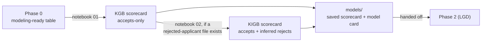

# Phase 1 -- PD Core Model

*Credit Risk Portfolio · account-level Probability of Default*

Phase 1 turns each dataset's Phase 0 modeling-ready table into a fitted, scaled,
production-style PD scorecard -- feature selection, WOE binning, a logistic
regression fit, calibration, points scaling, and (where the raw data allows it)
a reject-inference experiment.

---

## Contents

- [How a dataset moves through Phase 1](#how-a-dataset-moves-through-phase-1)
- [Folder structure (every dataset follows this)](#folder-structure-every-dataset-follows-this)
- [Dataset build status](#dataset-build-status)
- [Design principles](#design-principles)
- [Repository layout](#repository-layout)

---

## How a dataset moves through Phase 1



## Folder structure (every dataset follows this)

```
NN_dataset_name/
├── README.md                     dataset-specific notes and results
├── notebooks/
│   ├── 01_pd_kgb_scorecard.ipynb          accepts-only scorecard, end to end
│   └── 02_pd_reject_inference_kigb.ipynb  reject inference, if the data supports it
├── models/
│   ├── pd_scorecard_kgb_v1.joblib         the model actually used downstream
│   └── model_card_kgb_v1.json             features, performance, calibration, scaling
└── data/04_assets/tables/                 every headline table, saved standalone
```

## Dataset build status

| # | Dataset | Status | Headline result |
|---|---|---|---|
| 01 | **Lending Club** | Phase 1 complete -- see [`01_lendingclub/README.md`](01_lendingclub/README.md) | Test AUC 0.716, OOT AUC 0.700; reject inference tested and found not to move the model |
| 02 | **Fannie Mae** | Not started (awaiting Phase 0) | -- |

## Design principles

- **One notebook, one scorecard.** Feature selection, binning, fitting,
  validation, and scaling all happen in `01_pd_kgb_scorecard.ipynb`, in the
  order a reader would want to follow them -- no separate pipeline scripts.
- **Reject inference is a question, not an assumption.** `02_...kigb.ipynb`
  only exists to test whether adding declined applicants changes the model
  -- and reports honestly when the answer is "not with this data," rather
  than forcing a result.
- **Every number is computed live.** Model cards and tables are written by
  the notebook that produced them, from the notebook's own run -- not
  copied from an earlier draft or a different tool.
- **Findings are reported as found.** Right-censoring in the out-of-time
  slice, near-duplicate features, and validation checks that only partly
  pass are stated plainly rather than smoothed over.

## Repository layout

```
phase1_pd_modeling/
├── README.md                          this file
└── 01_lendingclub/
    ├── README.md
    ├── notebooks/
    ├── models/
    └── data/04_assets/tables/
```
