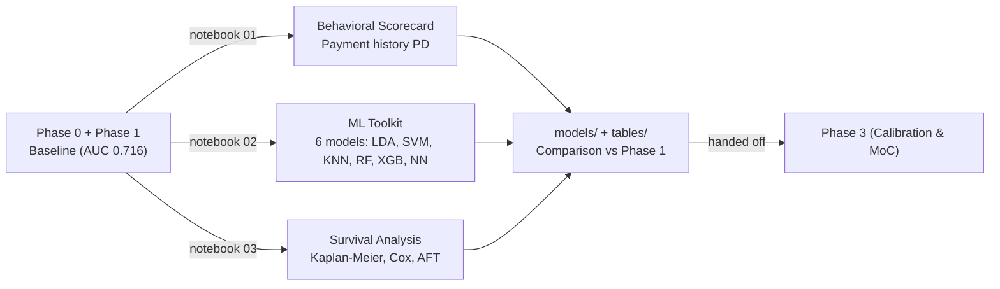

# Phase 2 -- Challenger Models & Alternative PD Approaches

*Credit Risk Portfolio · Behavioral, Machine Learning, and Survival Analysis Methods*

Phase 2 explores alternative approaches to PD modeling beyond Phase 1's logistic regression baseline. It builds three distinct methodological frameworks on the same cleaned data, answering: *which methodology best captures default risk for this portfolio, and when should each be preferred?*

---

## Contents

- [How a dataset moves through Phase 2](#how-a-dataset-moves-through-phase-2)
- [Folder structure (every dataset follows this)](#folder-structure-every-dataset-follows-this)
- [Dataset build status](#dataset-build-status)
- [Design principles](#design-principles)
- [Repository layout](#repository-layout)

---

## How a dataset moves through Phase 2



## Folder structure (every dataset follows this)

```
NN_dataset_name/
├── README.md                     dataset-specific notes and results
├── notebooks/
│   ├── 01_behavioral_scorecard.ipynb       Behavioral features, roll-rate PD
│   ├── 02_ml_toolkit.ipynb                 6 ML models, side-by-side comparison
│   └── 03_survival_analysis.ipynb          Kaplan-Meier, Cox, AFT, term structure
├── models/
│   ├── behavioral_scorecard_v1.joblib
│   ├── lda_v1.joblib
│   ├── svm_v1.joblib
│   ├── knn_v1.joblib
│   ├── random_forest_v1.joblib
│   ├── xgboost_v1.joblib
│   ├── neural_network_v1.joblib
│   ├── cox_model_v1.joblib
│   ├── aft_model_v1.joblib
│   └── (model cards in JSON)
└── data/04_assets/tables/                 every headline table, saved standalone
```

## Dataset build status

| # | Dataset | Status | Headline result |
|---|---|---|---|
| 01 | **Lending Club** | Phase 2 complete -- see [`01_lendingclub/README.md`](01_lendingclub/README.md) | Behavioral AUC 0.70-0.72; ML models 0.71-0.73; XGBoost wins; Survival analysis PD ~20% at 24 months |

## Design principles

- **Three distinct methodologies.** Behavioral (payment history), ML (six model types), and Survival (time-to-default) are three separate questions, not variants of one approach.
- **Same data, fair comparison.** All models trained/validated/tested on same Phase 0 data and same train/val/test split as Phase 1, ensuring comparability.
- **Feature selection is transparent.** Information Value (IV >= 0.02) for behavioral; same 31 Phase 0 columns for ML; time-to-event for survival.
- **Validation is the core.** All three compare to Phase 1 baseline (test AUC 0.716, OOT AUC 0.700). Performance gain must exceed 1-2% to justify added complexity.

## Repository layout

```
phase2_challenger_models/
├── README.md                          this file
└── 01_lendingclub/
    ├── README.md
    ├── notebooks/
    ├── models/
    └── data/04_assets/tables/
```
