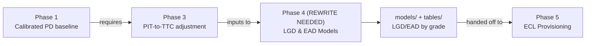

# Phase 4 -- LGD & EAD Models

*Credit Risk Portfolio · Loss Given Default and Exposure at Default Estimation*

⚠️ **IMPORTANT: This phase contains work that was built out of sequence and does not yet follow the correct methodology. See [Methodology Status](#methodology-status) below.**

---

## Methodology Status

### What's Wrong

The notebooks in this phase were built **before** Phase 1 (PD baseline) was established, and before Phase 3 (Calibration & MoC) was completed. As a result:

1. **Missing dependency on Phase 1 & 3**: These notebooks do not properly consume Phase 1's PD baseline model or Phase 3's calibrated PD outputs. They were built in isolation.
2. **Incorrect phase labeling**: Original work was labeled as "Phase 2/3" when it should have been Phase 4, creating structural confusion.
3. **Methodology gaps**: 
   - No proper PIT-to-TTC adjustment (from Phase 3) applied to PD assumptions
   - No representativeness testing alignment with Phase 1 baseline
   - LGD model does not account for segmentation by PD grade
   - EAD model lacks proper portfolio-level validation against Phase 1 cohorts
4. **Missing calibration step**: LGD/EAD models should be calibrated *after* Phase 3 establishes the representative PD, not before.

### What Needs to Happen

Before Phase 4 work can be finalized:

1. **Phase 1 must be completed**: Application scorecard with calibrated PD baseline (✅ Done)
2. **Phase 3 must be completed**: PIT-to-TTC adjustment, MoC, representativeness testing (Planned)
3. **Phase 4 must be rewritten to**:
   - Load Phase 1's PD model as a reference for segmentation
   - Load Phase 3's calibrated PD outputs (TTC PD, MoC adjustments)
   - Build LGD model with explicit grade-by-grade segmentation
   - Build EAD model aligned to Phase 1's feature space
   - Apply portfolio-level validation against Phase 1 cohorts
   - Document assumptions tied to Phase 3's calibration approach

---

## Contents

- [How a dataset moves through Phase 4](#how-a-dataset-moves-through-phase-4)
- [Folder structure](#folder-structure)
- [Dataset build status](#dataset-build-status)
- [Preserved Work](#preserved-work)
- [Next Steps](#next-steps)

---

## How a dataset moves through Phase 4



---

## Folder structure

```
phase4_lgd_ead_models/
├── README.md                          this file
└── 01_lendingclub/
    ├── README.md                      dataset-specific notes and current status
    ├── notebooks/
    │   ├── 01_lgd_baseline_model.ipynb        [NEEDS REWRITE — see caveats]
    │   └── 02_ead_analysis_and_sensitivity.ipynb [NEEDS REWRITE — see caveats]
    ├── models/
    │   └── (preserved model outputs, not yet regenerated)
    └── data/04_assets/tables/
        └── (preserved tables, not yet regenerated)
```

---

## Dataset build status

| # | Dataset | Status | Headline result | Action |
|---|---|---|---|---|
| 01 | **Lending Club** | Preserved pending Phase 3 → Needs rewrite | LGD ~73%, EAD ~$8.7K | Awaiting Phase 3; rewrite after Phase 3 completion |

---

## Preserved Work

The two notebooks in this phase are **preserved as reference** from earlier work:

- **01_lgd_baseline_model.ipynb**: Logistic regression on LGDV (loss/funded_amnt) with origination features. Expected output: LGD ~73% mean.
- **02_ead_analysis_and_sensitivity.ipynb**: EAD analysis by vintage and grade, with sensitivity to prepayment/utilization assumptions. Expected output: EAD ~$8.7K mean.

### Known Issues with Preserved Work

1. **No Phase 1 integration**: These notebooks do not load Phase 1's PD model or outputs.
2. **No Phase 3 calibration**: No TTC adjustment, no representativeness testing, no explicit MoC assumptions.
3. **Feature space misalignment**: May use features not selected by Phase 1, creating inconsistency.
4. **No segmentation by PD grade**: LGD/EAD should be modeled separately by Phase 1's grade buckets.
5. **Validation approach**: No back-testing against Phase 1 cohorts; no comparison to Basel segmentation rules.

---

## Design Principles (Correct Phase 4 Approach)

Phase 4 should follow these principles:

1. **Consume Phase 1 & 3 outputs**: LGD/EAD models must use Phase 1's PD grades and Phase 3's calibrated PD as segmentation anchors.
2. **Explicit segmentation**: Build separate LGD and EAD models by PD grade (or equivalent risk bucket).
3. **Proper population definition**: Define LGD population (matured defaulted vs matured non-defaulted loans) and EAD population (current outstanding exposures) with clear vintage alignment.
4. **Validation**: Compare to Phase 1 cohorts; validate that implied ECL from LGD×EAD×PD matches banking practice.
5. **Documentation**: Model cards must reference Phase 1 grade definitions and Phase 3 MoC assumptions.

---

## Next Steps

1. **Complete Phase 3**: Build calibration & MoC framework (PIT-to-TTC adjustment, representativeness testing, MoC bounds).
2. **Review Phase 3 outputs**: Understand final PD calibration, TTC adjustments, grade boundaries, MoC assumptions.
3. **Rewrite Phase 4 notebooks**:
   - Notebook 01: LGD model by PD grade (logistic or ordinal regression on loss rate).
   - Notebook 02: EAD model by exposure type (revolving vs term, by origination vintage).
   - Both: Load Phase 1 scorecard model and Phase 3 calibration outputs; segment by grade; document assumptions.
4. **Generate new model cards and comparison tables** aligned to rewritten methodology.
5. **Hand off to Phase 5** with clear documentation of LGD/EAD assumptions and their ties to Phase 1 & 3.

---

## References

- **Phase 1 (PD Baseline)**: `../phase1_pd_modeling/01_lendingclub/README.md`
- **Phase 3 (Calibration & MoC)**: `../phase3_calibration_moc/README.md` [Planned]
- **Course Material**: See `docs/Peaks2Tails_Knowledge_Base.md` for LGD/EAD methodology
- **Status**: Preserved pending Phase 3 completion; scheduled for rewrite after calibration framework is established
