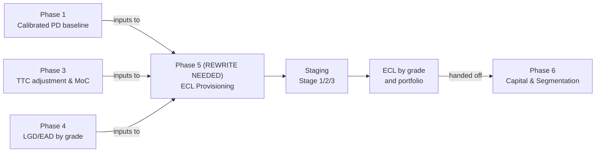

# Phase 5 -- IFRS 9 ECL Provisioning

*Credit Risk Portfolio · Expected Credit Loss Calculation, Staging, and Provisioning*

⚠️ **IMPORTANT: This phase contains work that was built out of sequence and does not yet follow the correct methodology. See [Methodology Status](#methodology-status) below.**

---

## Methodology Status

### What's Wrong

The notebooks in this phase were built **before** Phase 1 (PD baseline), Phase 3 (Calibration & MoC), and Phase 4 (LGD/EAD models) were completed in their final forms. As a result:

1. **Missing dependencies on Phase 1, 3, and 4**: 
   - These notebooks do not consume Phase 1's PD baseline or Phase 3's calibrated/TTC-adjusted PD
   - They do not use Phase 4's segmented LGD/EAD models
   - Staging logic was built without a finalized PD framework
2. **Incorrect phase labeling**: Original work was labeled as "Phase 2/3" when it should have been Phase 5, creating structural confusion.
3. **Methodology gaps**:
   - Staging thresholds may not align with Phase 3's representativeness testing
   - ECL calculation uses provisional LGD/EAD estimates (not yet validated)
   - No application of Phase 3's MoC to ECL provisioning
   - Macro scenario framework not yet developed (Phase 7 later)
   - Portfolio-level ECL not validated against Phase 1 cohorts or banking norms
4. **Missing calibration steps**: 
   - ECL should be calculated using Phase 1's calibrated PD, Phase 3's TTC adjustment and MoC, and Phase 4's validated LGD/EAD
   - Current notebooks use placeholder or partial estimates

### What Needs to Happen

Before Phase 5 work can be finalized:

1. **Phase 1 must be completed**: Application scorecard with calibrated PD baseline (✅ Done)
2. **Phase 3 must be completed**: PIT-to-TTC adjustment, MoC, representativeness testing (Planned)
3. **Phase 4 must be completed**: Validated LGD and EAD models by risk grade (Planned; awaiting Phase 3)
4. **Phase 5 must be rewritten to**:
   - Load Phase 1's calibrated PD by grade
   - Load Phase 3's TTC-adjusted PD and MoC bounds
   - Load Phase 4's segmented LGD and EAD models by grade
   - Apply staging logic tied to Phase 3's representativeness framework (probability of default increases significantly = Stage 2)
   - Calculate ECL for each grade: Stage 1 = 12-month LGD×EAD×PD×(1+MoC); Stage 2/3 = lifetime LGD×EAD×PD×(1+MoC)
   - Validate portfolio ECL against Phase 1 cohorts and industry benchmarks
   - Document all assumptions tied to Phase 1, 3, and 4 outputs

---

## Contents

- [How a dataset moves through Phase 5](#how-a-dataset-moves-through-phase-5)
- [Folder structure](#folder-structure)
- [Dataset build status](#dataset-build-status)
- [Preserved Work](#preserved-work)
- [Next Steps](#next-steps)

---

## How a dataset moves through Phase 5



---

## Folder structure

```
phase5_ecl_provisioning/
├── README.md                          this file
└── 01_lendingclub/
    ├── README.md                      dataset-specific notes and current status
    ├── notebooks/
    │   ├── 01_ecl_baseline_and_staging.ipynb     [NEEDS REWRITE — see caveats]
    │   └── 02_ecl_sensitivity_and_validation.ipynb [NEEDS REWRITE — see caveats]
    ├── models/
    │   └── (preserved model outputs, not yet regenerated)
    └── data/04_assets/tables/
        └── (preserved tables, not yet regenerated)
```

---

## Dataset build status

| # | Dataset | Status | Headline result | Action |
|---|---|---|---|---|
| 01 | **Lending Club** | Preserved pending Phase 3 & 4 → Needs rewrite | ECL ~$55-70M (~1.8-2.2% of AUM) | Awaiting Phase 3 & 4; rewrite after both complete |

---

## Preserved Work

The two notebooks in this phase are **preserved as reference** from earlier work:

- **01_ecl_baseline_and_staging.ipynb**: IFRS 9 staging logic (Stage 1/2/3) applied to portfolio with provisional PD and default definitions. Expected output: portfolio ECL ~$55-70M.
- **02_ecl_sensitivity_and_validation.ipynb**: Sensitivity analysis on ECL to PD/LGD/EAD assumptions and macro scenarios. Expected output: ECL ranges under different assumptions.

### Known Issues with Preserved Work

1. **No Phase 1 integration**: These notebooks do not load Phase 1's PD baseline or its risk grades.
2. **No Phase 3 calibration**: No TTC adjustment, no representativeness testing, no MoC applied to ECL.
3. **No Phase 4 LGD/EAD**: Uses placeholder or partial LGD/EAD estimates, not validated models.
4. **Staging logic issues**: 
   - Thresholds may not align with Phase 3's framework for "significant increase in credit risk"
   - No explicit PD term-structure applied (survival analysis from Phase 2 not integrated)
   - No back-testing against Phase 1 cohorts
5. **Scenario framework incomplete**: Macro scenario sensitivity built without Phase 7's scenario framework.
6. **No portfolio validation**: ECL not back-tested to check: does it match observed loss experience?

---

## Design Principles (Correct Phase 5 Approach)

Phase 5 should follow these principles:

1. **Consume Phase 1, 3, and 4 outputs**:
   - Phase 1: PD by risk grade
   - Phase 3: TTC-adjusted PD, MoC bounds, representativeness testing framework
   - Phase 4: Validated LGD and EAD by risk grade
2. **Proper staging logic**: 
   - **Stage 1**: New originations or loans with no significant increase in credit risk (PD increase < threshold from Phase 3)
   - **Stage 2**: Loans with significant increase in credit risk (PD increase >= threshold from Phase 3)
   - **Stage 3**: Defaulted loans (as defined by Phase 1)
   - Thresholds tied to Phase 3's representativeness framework
3. **ECL calculation by stage**:
   - Stage 1: 12-month ECL = LGD × EAD × 12m-PD × (1 + MoC)
   - Stage 2/3: Lifetime ECL = LGD × EAD × lifetime-PD × (1 + MoC)
   - Term structure from Phase 2 survival analysis (if available)
4. **Segmentation**: Calculate ECL by grade separately, then aggregate to portfolio
5. **Validation**: Back-test ECL against observed loss experience; validate that portfolio ECL / AUM matches banking practice (typically 1.5-3%)
6. **Documentation**: Model cards must reference Phase 1 grades, Phase 3 MoC assumptions, and Phase 4 LGD/EAD validation

---

## Next Steps

1. **Complete Phase 3**: Build calibration & MoC framework (PIT-to-TTC adjustment, representativeness testing, MoC bounds).
2. **Complete Phase 4**: Build validated LGD and EAD models by risk grade.
3. **Review Phases 1, 3, and 4 outputs**: Understand final PD calibration, TTC adjustments, grade boundaries, LGD/EAD estimates, MoC assumptions.
4. **Rewrite Phase 5 notebooks**:
   - Notebook 01: Load Phase 1 PD, Phase 3 TTC adjustment and MoC, Phase 4 LGD/EAD. Implement staging logic with Phase 3 thresholds. Calculate Stage 1/2/3 ECL by grade.
   - Notebook 02: Sensitivity analysis using Phase 3's scenario framework (once available). Validate portfolio ECL against Phase 1 cohorts and banking benchmarks.
5. **Generate new model cards and validation tables** aligned to rewritten methodology.
6. **Hand off to Phase 6** (Capital & Segmentation) with clear documentation of ECL assumptions and their ties to Phases 1, 3, and 4.

---

## References

- **Phase 1 (PD Baseline)**: `../phase1_pd_modeling/01_lendingclub/README.md`
- **Phase 3 (Calibration & MoC)**: `../phase3_calibration_moc/README.md` [Planned]
- **Phase 4 (LGD & EAD)**: `../phase4_lgd_ead_models/01_lendingclub/README.md`
- **Course Material**: See `docs/Peaks2Tails_Knowledge_Base.md` for ECL and IFRS 9 methodology
- **Status**: Preserved pending Phase 3 & 4 completion; scheduled for rewrite after both are established
